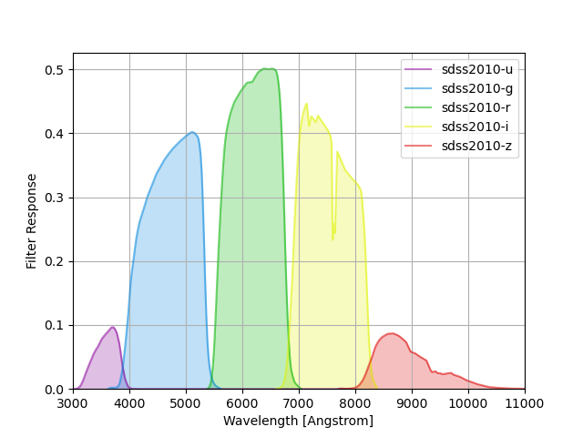
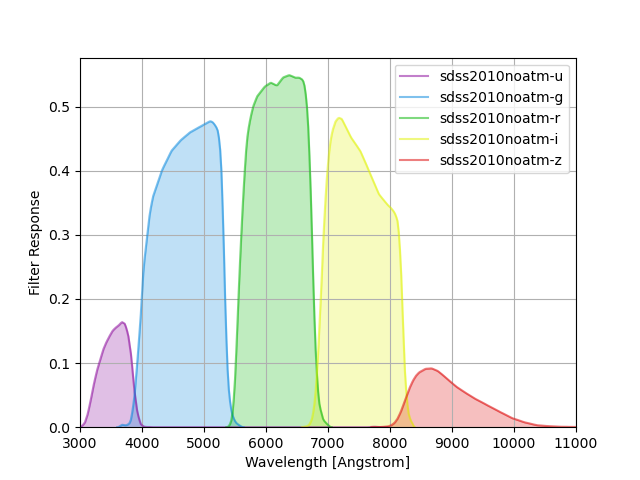
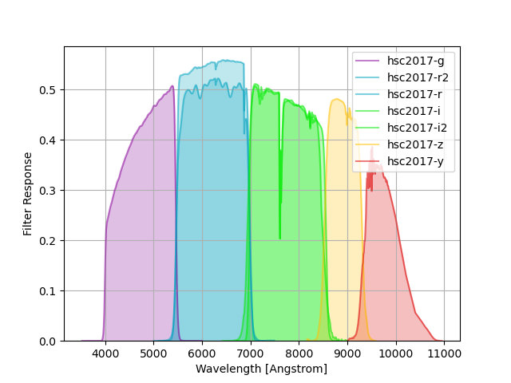

Filter Response Curves
======================

The ``data/filters/`` subdirectory contains small files with tabulated filter
response curves.  All files contain a single curve stored in the ASCII `enhanced
character-separated value format
<https://github.com/astropy/astropy-APEs/blob/master/APE6.rst>`__, which is used
to specify the wavelength units and provide the following metadata:

+------------+-------------------------------------------------------------------------+
|Key         | Description                                                             |
+============+=========================================================================+
|group_name  | Name of the group that this filter response belongs to, e.g., sdss2010. |
+------------+-------------------------------------------------------------------------+
|band_name   | Name of the filter pass band, e.g., r.                                  |
+------------+-------------------------------------------------------------------------+
|airmass     | Airmass used for atmospheric transmission, or zero for no atmosphere.   |
+------------+-------------------------------------------------------------------------+
|url         | URL with more details on how this filter response was obtained.         |
+------------+-------------------------------------------------------------------------+
|description | Brief description of this filter response.                              |
+------------+-------------------------------------------------------------------------+

The following sections summarize the standard filters included with the ``speclite``
code distribution.  Refer to the :ref:`filters module <filters-api>` API docs for
details and examples of how to load an use these filters.  See
:ref:`below <custom-filters>` for instructions on working with your own custom
filters.

SDSS Filters
------------

SDSS filter responses are taken from Table 4 of `Doi et al, "Photometric
Response Functions of the SDSS Imager", The Astronomical Journal, Volume 139,
Issue 4, pp. 1628-1648 (2010)
<http://dx.doi.org/10.1088/0004-6256/139/4/1628>`__, and calculated as the
reference response multiplied by the reference APO atmospheric transmission at
an airmass 1.3. See the paper for details.

The group name ``sdss2010`` is used to identify these response curves in
``speclite``. The plot below shows the output of::

    sdss = speclite.filters.load_filters('sdss2010-*')
    speclite.filters.plot_filters(sdss, wavelength_limits=(3000, 11000))

We also provide versions of the filters without the atmospheric transmission
which are identified by the ``sdss2010noatm`` group name and can be visualized
with this bit of code::

    sdss_noatm = speclite.filters.load_filters('sdss2010noatm-*')
    speclite.filters.plot_filters(sdss_noatm, wavelength_limits=(3000, 11000))

2MASS Filters
-------------

2MASS filter responses are taken from `Cohen, Wheaton & Megeath, "Spectral
Irradiance Calibration in the Infrared. XIV. The Absolute Calibration of 2MASS",
The Astronomical Journal, Volume 126, Issue 2, pp. 1090-1096
(2003) <http://dx.doi.org/10.1086/376474>`__, as tabulated by Michael
Blanton. See the paper for details.

The group name ``twomass`` is used to identify these response curves in
``speclite``. The plot below shows the output of::

    twomass = speclite.filters.load_filters('twomass-*')
    speclite.filters.plot_filters(twomass, wavelength_limits=(10000, 25000))

GALEX Filters
-------------

The command below produces the figure::

    galex = speclite.filters.load_filters('galex-*')
    speclite.filters.plot_filters(galex)

ODIN Narrow-band Filters
------------------------

The One-hundred-deg\ :sup:`2` DECam Imaging in Narrowbands (ODIN) survey filters
consist of three narrow-band filters centered at (approximately) 419, 501, and
673 nm.

The command below produces the figure::

    odin = speclite.filters.load_filters('odin-*')
    speclite.filters.plot_filters(odin, legend_loc='upper left')

DECam DR1 Filters
-----------------

The DECam DR1 filter curves are documented in `T. M. C. Abbott et al 2018 ApJS
239 18 <https://iopscience.iop.org/article/10.3847/1538-4365/aae9f0>`__ and
available from this `NOAO DECam page
<http://www.ctio.noao.edu/noao/content/DECam-filter-information>`__. These
represent the total system throughput and average instrumental response across
the science CCDs.  The official curves have arbitrary normalization, but the
values used here have reasonable normalization factors applied for throughput
calculations, provided by Douglas Tucker (Jan 2021, private communication).

There are two versions of the DR1 curves: ``decamDR1`` with an airmass 1.2 reference atmosphere, and
``decamDR1noatm`` with no atmospheric extinction::

    with_atm = speclite.filters.load_filters('decamDR1-*')
    speclite.filters.plot_filters(with_atm)
    without_atm = speclite.filters.load_filters('decamDR1noatm-*')
    speclite.filters.plot_filters(without_atm)

.. image:: _static/decamDR1.png
    :alt: decamDR1 filter curves with X=1.2 atmosphere

.. image:: _static/decamDR1noatm.png
    :alt: decamDR1 filter curves without atmosphere

DECam 2014 Filters
------------------

The DECam 2014 filter responses are taken from this `Excel spreadsheet
<http://www.ctio.noao.edu/noao/sites/default/files/DECam/DECam_filters.xlsx>`__
created by William Wester in September 2014 and linked to this `NOAO DECam page
<http://www.ctio.noao.edu/noao/content/dark-energy-camera-decam>`__.
Throughputs include a reference atmosphere with airmass 1.3 provided by Ting Li.
These are the most recent publicly available DECam throughputs as of Feb 2016.

The group name ``decam2014`` is used to identify these response curves in
``speclite``. The plot below shows the output of::

    decam = speclite.filters.load_filters('decam2014-*')
    speclite.filters.plot_filters(
        decam, wavelength_limits=(3000, 11000), legend_loc='upper left')

.. image:: _static/decam2014.png
    :alt: decam2014 filter curves

WISE Filters
------------

WISE filter responses are taken from files linked to `this page
<http://wise2.ipac.caltech.edu/docs/release/prelim/expsup/sec4_3g.html#WISEZMA>`__
containing the weighted mean relative spectral responses described in `Wright et
al, "The Wide-field Infrared Survey Explorer (WISE): Mission Description and
Initial On-orbit Performance", The Astronomical Journal, Volume 140, Issue 6,
pp. 1868-1881 (2010) <http://dx.doi.org/10.1088/0004-6256/140/6/1868>`__.

Note that these responses are based on pre-flight measurements but the in-flight
responses of the W3 and W4 filters are observed to have effective wavelengths
that differ by -(3-5)% and +(2-3)%, respectively.  Refer to Section 2.2 of
`Wright et al. 2010 <http://dx.doi.org/10.1088/0004-6256/140/6/1868>`__ for details.
See also Section 2.1.3 of `Brown 2014
<http://dx.doi.org/10.1088/0067-0049/212/2/18>`__ for further details about W4.

The group name ``wise2010`` is used to identify these response curves in
``speclite``.  The plot below shows the output of the command below, and matches
Figure 6 of the paper::

    wise = speclite.filters.load_filters('wise2010-*')
    speclite.filters.plot_filters(wise, wavelength_limits=(2, 30),
        wavelength_unit=astropy.units.micron, wavelength_scale='log')
    plt.gca().set_xticks([2, 5, 10, 20, 30])
    plt.gca().set_xticklabels([2, 5, 10, 20, 30])

.. image:: _static/wise2010.png
    :alt: wise2010 filter curves

HSC Filters
-----------

HSC filter responses are taken from `here
<https://hsc-release.mtk.nao.ac.jp/doc/index.php/survey/>`__. These throughputs
include a reference atmosphere with airmass 1.2. Refer to Kawanamoto et al. 2017
(in prep).

The group name ``hsc2017`` is used to identify these curves in ``speclite``.
The plot below shows the output of the following command::

    hsc = speclite.filters.load_filters('hsc2017-*')
    speclite.filters.plot_filters(hsc)

Suprime-Cam Intermediate-band Filters
-------------------------------------

Intermediate-band Suprime-Cam filters taken from
`here
<http://svo2.cab.inta-csic.es/theory/fps/index.php?mode=browse&gname=Subaru&gname2=Suprime&asttype=>`__. The
response is the total transmission, including the filter, the instrument, and
the atmosphere.

The command below produces the figure::

    suprime = speclite.filters.load_filters('suprime-*')
    speclite.filters.plot_filters(suprime, legend_ncols=3, response_limits=[0, 1.5])

LSST Filters
------------

LSST filter responses are taken from tag 12.0 of the LSST simulations
`throughputs package <https://github.com/lsst/throughputs>`__ and include a
standard atmosphere with airmass 1.2 that is also tabulated in the same package.

The group name ``lsst2016`` is used to identify these response curves in ``speclite``.
The plot below shows the output of the command below, and matches
Figure 6 of the paper::

    lsst = speclite.filters.load_filters('lsst2016-*')
    speclite.filters.plot_filters(
        lsst, wavelength_limits=(3000, 11000), legend_loc='upper left')

.. image:: _static/lsst2016.png
    :alt: lsst filter curves

Johnson/Cousins Filters
-----------------------

Reference definitions of the Johnson/Cousins "standard" filters are taken
from Table 2 of `Bessell, M. S., "UBVRI passbands," PASP, vol. 102, Oct. 1990,
p. 1181-1199 <http://dx.doi.org/10.1086/132749>`__. We use the band name "U" for
the response that Table 2 refers to as "UX". Note that these do not represent
the response of any actual instrument. Response values are normalized to have a
maximum of one in each band.

The group name `bessell` is used to identify these response curves in
``speclite``.  The plot below shows the output of the command below::

    bessell = speclite.filters.load_filters('bessell-*')
    speclite.filters.plot_filters(bessell, wavelength_limits=(2900, 9300))

.. image:: _static/bessell.png
    :alt: bessell filter curves

DESI Imaging Survey Filters
---------------------------

The DESI spectroscopic survey used imaging from the DECam, BASS and MzLS instruments
to build its target catalog.  The relevant BASS and MzLS filters are::

    desi_imaging = speclite.filters.load_filters('BASS-g', 'BASS-r', 'MzLS-z')
    speclite.filters.plot_filters(desi_imaging)

.. image:: _static/desi_imaging.png
    :alt: DESI imaging filter curves

Euclid Filters
--------------

The current best end-of-life estimates for the "VIS", "Y", "H", and "J" total throughputs for Euclid,
i.e., "Y", "H", and "J" have been convolved by the "NISP" throughput. The original tables can be found
`here <http://euclid.esac.esa.int/epdb/db/SC456Draft/>`__. The group name ``Euclid`` is used
to identify these curves in ``speclite``.
The command below produces the figure::

    euclid = speclite.filters.load_filters('Euclid-VIS', 'Euclid-Y', 'Euclid-H', 'Euclid-J')
    speclite.filters.plot_filters(euclid)

Gaia Filters
------------

The (revised) filters from DR2 documented
`here <https://www.cosmos.esa.int/web/gaia/iow_20180316>`__.

The command below produces the figure::

    gaiadr2 = speclite.filters.load_filters('gaiadr2-*')
    speclite.filters.plot_filters(gaiadr2)

.. image:: _static/gaiadr2.png
    :alt: GAIA DR2 filter curves

.. _custom-filters:

Custom Filters
--------------

In addition to the standard filters included with the ``speclite`` code
distribution, you can create and read your own custom filters.  For example
to define a new filter group called "fangs" with "g" and "r" bands, you
will first need to define your filter responses with new
:class:`speclite.filters.FilterResponse` objects::

    fangs_g = speclite.filters.FilterResponse(
        wavelength = [3800, 4500, 5200] * u.Angstrom,
        response = [0, 0.5, 0], meta=dict(group_name='fangs', band_name='g'))
    fangs_r = speclite.filters.FilterResponse(
        wavelength = [4800, 5500, 6200] * u.Angstrom,
        response = [0, 0.5, 0], meta=dict(group_name='fangs', band_name='r'))

Your metadata dictionary must include the ``group_name`` and ``band_name``
keys, but all of the keys listed above are recommended. You can now load and
use these filters with their canonical names, although the group wildcard
``fangs-*`` is not supported.  For example::

    fangs = speclite.filters.load_filters('fangs-g', 'fangs-r')
    speclite.filters.plot_filters(fangs)

.. image:: _static/custom.png
    :alt: custom filter curves

Next, save these filters in the correct format to any directory::

    directory_name = '.'
    fg_name = fangs_g.save(directory_name)
    fr_name = fangs_r.save(directory_name)

Note that the file name in the specified directory is determined automatically
based on the filter's group and band names.

Finally, you can now read these custom filters from other programs by
calling :func:`speclite.filters.load_filter` with paths::

    directory_name = '.'
    fg_name = os.path.join(directory_name, 'fangs-g.ecsv')
    fr_name = os.path.join(directory_name, 'fangs-r.ecsv')
    fangs_g = speclite.filters.load_filter(fg_name)
    fangs_r = speclite.filters.load_filter(fr_name)

Note that :func:`load_filter <speclite.filters.load_filter>` and
:func:`load_filters <speclite.filters.load_filters>`
look for the ".ecsv" extension in the name to recognize a custom filter.
